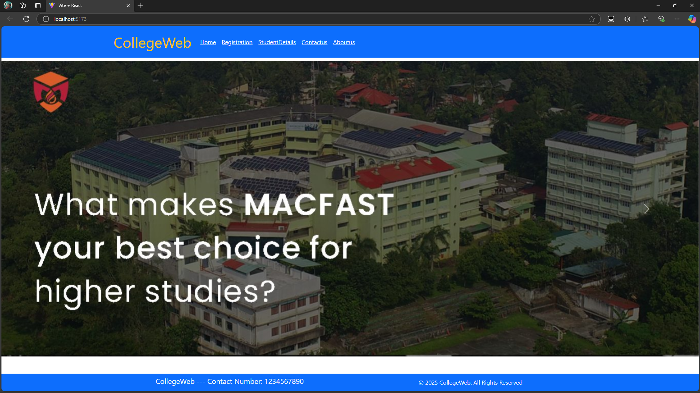
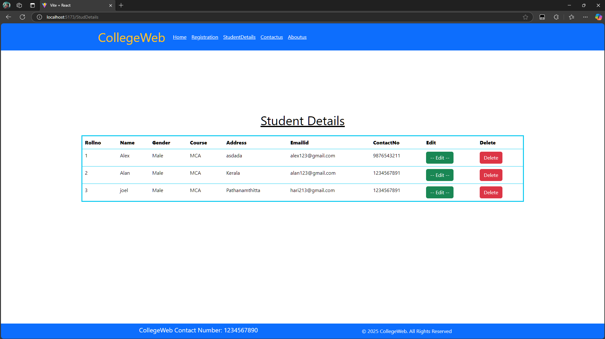
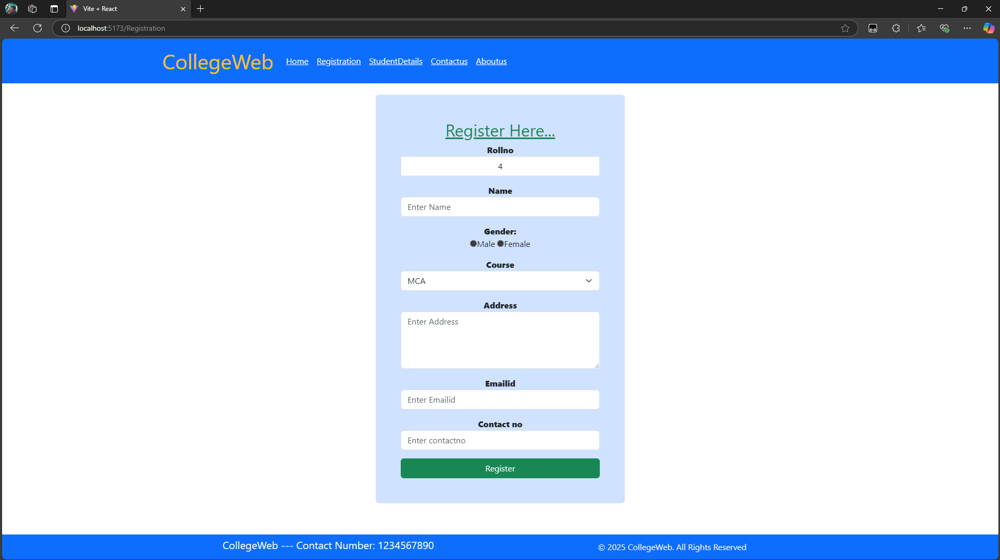
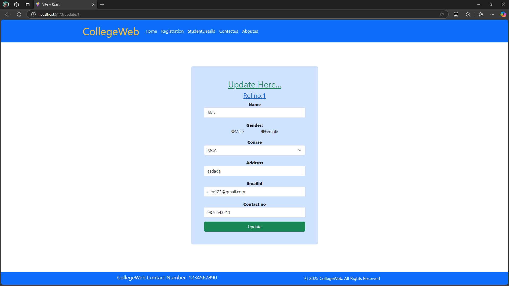
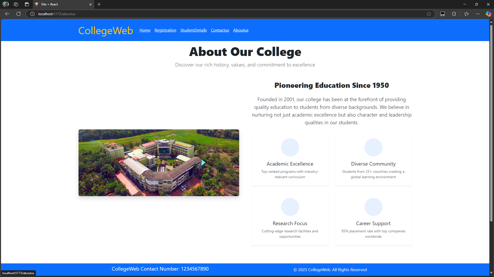
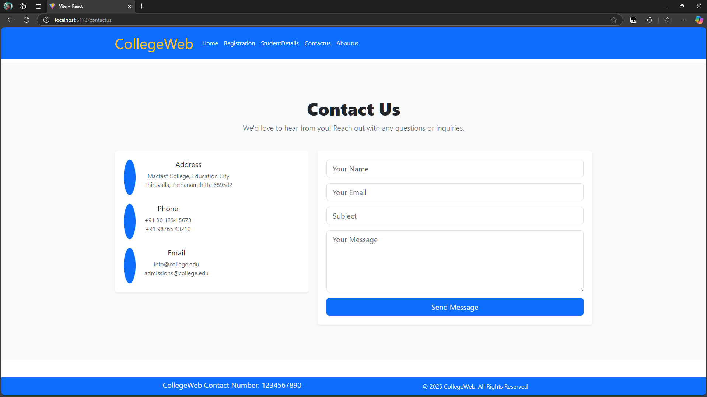

# MERN Stack Learning Project


A full-stack web application built as part of our college's extra learning course, implementing the MERN stack (MongoDB, Express.js, React, and Node.js).

## Features

- Student registeration system (registration)
- CRUD operations implementation
- RESTful API with Express.js
- React frontend with Vite
- MongoDB database integration
- Responsive design

## 🛠️ Technologies Used

### Frontend

<p align="left">
  
  
  
</p>

### Backend

<p align="left">
  
  
  
</p>

### Tools

<p align="left">
  
  
  
  
</p>

Try for yourself :)

### Install dependencies:

```bash
npm install
```

### Start the development server:

```bash
npm run dev
```

- This will launch the website on http://localhost:5173

#### In a separate terminal,start the backend server :

```bash
node src/server/server.js
```

- It will connect to the database which is MongoDB.

#### If errors occurs in connecting to MongoDB

- Check your path for MongoDB
  (Mine didn't work for sometime until i figured some way to fix it)

- If you face a Connection refused error repair your path using this command :

```bash
mongod --repair --dbpath /path/to/your/db
```

This might fix the issue :)

I created a folder in the C: drive `\data\db` (Not recommended) which helped me solve the issue.it worked somehow.

#### Ensure your services are running

- Check MongoDB service (start) it if not running

```
MongoDB : 27017 (portnumber)
```

## 📸 Screenshots

### Homepage

  
_Landing page_

### Student Dashboard

  
_Student data management interface_

### Registration Page

  
_User sign-up form with validation_

### Edit Page

  
_Update Page_

### About Us

  
_Project and team information section_

### Contact Page

  
_Contact form_

<div align=center>

[](https://mernproject-frontend.netlify.app/)

